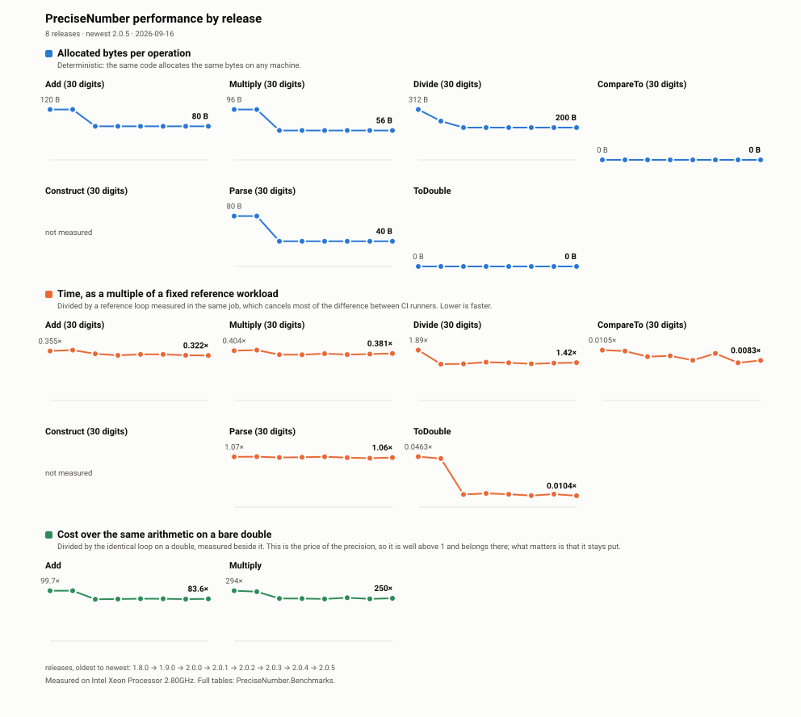

# ktsu.PreciseNumber  

A high-precision numeric type for .NET that provides arbitrary precision arithmetic with a focus on accuracy. By combining the scale benefits of scientific notation with the precision of `BigInteger`, this library offers reliable and accurate mathematical operations where standard floating point types fall short.  

[](LICENSE.md)
[](https://nuget.org/packages/ktsu.PreciseNumber)
[](https://nuget.org/packages/ktsu.PreciseNumber)
[](https://nuget.org/packages/ktsu.PreciseNumber)
[](https://github.com/ktsu-dev/PreciseNumber/commits/main)
[](https://github.com/ktsu-dev/PreciseNumber/graphs/contributors)
[](https://github.com/ktsu-dev/PreciseNumber/actions)

## Table of Contents  

- [Features](#features)  

- [Performance](#performance)  

- [Getting Started](#getting-started)  

- [Installation](#installation)  

- [Requirements](#requirements)  

- [Quick Usage](#quick-usage)  

- [Basic Example](#basic-example)  

- [Common Operations](#common-operations)  

- [When to Use PreciseNumber](#when-to-use-precisenumber)  

- [Advanced Usage](#advanced-usage)  

- [Type Conversions](#type-conversions)  

- [Mathematical Functions](#mathematical-functions)  

- [Parsing and Formatting](#parsing-and-formatting)  

- [Parsing from Strings](#parsing-from-strings)  

- [String Formatting](#string-formatting)  

- [Comparison with Built-in Types](#comparison-with-built-in-types)  

- [PreciseNumber vs. double/float](#precisenumber-vs-doublefloat)  

- [PreciseNumber vs. decimal](#precisenumber-vs-decimal)  

- [PreciseNumber vs. BigInteger](#precisenumber-vs-biginteger)  

- [Technical Details](#technical-details)  

- [Internal Representation](#internal-representation)  

- [Precision Control](#precision-control)  

- [Limitations](#limitations)  

- [API Reference](#api-reference)  

- [PreciseNumber Class](#precisenumber-class)  

- [PreciseNumberExtensions Class](#precisenumberextensions-class)  

- [License](#license)  

- [Contributing](#contributing)  

- [Acknowledgements](#acknowledgements)  

## Features  

- **Arbitrary Precision**: Based on `BigInteger` for the significand, allowing numbers of unlimited size.  

- **Scientific Notation**: Uses an exponent and significand (the coefficient or mantissa in scientific notation) model similar to scientific notation.  

- **Lossless Arithmetic**: Preserves precision during calculations with no rounding errors.  

- **Full .NET Integration**: Implements `INumber<T>`, including `CreateChecked`, `CreateSaturating`, and `CreateTruncating` in both directions, so generic math code can create and convert values.  

- **Value Type**: A `readonly record struct` whose `default` value is zero. Adding, subtracting, multiplying, and comparing allocate nothing when the operands and every intermediate and final significand fit in an `int`. Exponent alignment counts, so `1 + 0.0000000001` allocates because it scales 1 by 10^10, and `99999 * 99999` allocates because its product is 9,999,800,001.  

- **Comprehensive Mathematical Support**: Includes advanced mathematical functions like exponential operations (Pow, Exp, Squared, Cubed), roots (Sqrt, Cbrt, RootN, Hypot) through `IRootFunctions<T>`, constant values (Pi, E, Tau) with high precision, absolute value operations, and specialized numerical checks (isOdd, isEven, etc.)—all with arbitrary precision.  

- **Balanced Performance**: The design prioritizes accuracy and precision while maintaining reasonable performance. For calculations where extreme precision matters more than raw speed, PreciseNumber delivers excellent results, though built-in numeric types remain faster for standard precision needs.  

## Performance  

Values are immutable value types. Every operation returns a new value, but that value lives inline
in its variable, field, or array element, so the only heap allocation is the `BigInteger` digit
array, and a significand that fits in an `int` doesn't need one. Cost therefore tracks the number
of significant digits rather than the magnitude of the value, and allocation matters as much as
raw speed.  

<picture>
  <source media="(prefers-color-scheme: dark)" srcset="docs/benchmarks/performance-dark.svg">
  
</picture>

Every release measures a fixed set of benchmarks and adds a point to the chart above; the numbers
behind it are in [`docs/benchmarks/history.json`](docs/benchmarks/history.json).  

Read the two halves differently. **Allocation is exact** — the same code allocates the same bytes on
any machine, so a step in the top row is always a real change. **Time is measured on shared CI
runners**, where the host a job happens to land on varies more than most releases do, so each time
is divided by a reference workload measured in the same job. That cancels most of the difference
between machines; what is left is indicative rather than precise, and a small wobble between two
releases is more likely the runner than the library.  

The repository carries a [BenchmarkDotNet suite](PreciseNumber.Benchmarks/README.md) covering
construction, comparison, arithmetic, rounding, text conversion and primitive conversion, each
parameterised across 8, 30 and 200 significant digits:  

```bash
dotnet run -c Release --project PreciseNumber.Benchmarks -- --filter '*ArithmeticBenchmarks*'
```

Run it before and after any change to the library's internals. A full run can also be started
from the **Benchmarks** workflow in GitHub Actions, which archives the reports against the commit
that produced them.  

# Getting Started  

## Installation  

To install PreciseNumber, you can use the .NET CLI:  

```sh  
dotnet add package ktsu.PreciseNumber  

```  

Or you can use the NuGet Package Manager in Visual Studio by searching for `ktsu.PreciseNumber`.  

## Requirements  

This library requires .NET 8.0 or later.  

## Quick Usage  

### Basic Example  

```csharp  
using System.Numerics;  
using ktsu.PreciseNumber;  

// Create PreciseNumber from various types  
var precise1 = 123.456.ToPreciseNumber();  
var precise2 = BigInteger.Parse("1234567890").ToPreciseNumber();  

// Perform calculation with high precision  
var result = precise1 * precise2 / 7.89.ToPreciseNumber();  

Console.WriteLine(result); // Displays accurate result with no floating point errors  

```  

### Common Operations  

Create and perform operations with precise numbers:  

```csharp  
using ktsu.PreciseNumber;  

// Create PreciseNumbers from various numeric types  
var a = 123.456.ToPreciseNumber();  
var b = 2.ToPreciseNumber();  

// Basic arithmetic operations  
var sum = a + b;        // 125.456  

var difference = a - b; // 121.456  

var product = a * b;    // 246.912  

var quotient = a / b;   // 61.728  

// Comparison  
bool isGreater = a > b; // true  

```  

### When to Use PreciseNumber  

PreciseNumber is ideal for:  

- **Financial calculations** where exact precision is required beyond what decimal offers  

- **Scientific computing** involving very large or small numbers with many significant digits  

- **Cryptography** applications requiring arbitrary precision arithmetic  

- **Mathematical algorithms** where rounding errors would accumulate and affect results  

For everyday calculations where standard precision is sufficient, built-in types like `int`, `double`, or `decimal` will offer better performance.  

# Advanced Usage  

## Type Conversions  

The library provides seamless round-trip conversions between standard numeric types and PreciseNumber using extension methods:  

```csharp  
using System.Numerics;  
using ktsu.PreciseNumber;  

// Convert FROM standard types TO PreciseNumber  
int originalInt = 42;  
double originalDouble = 3.14159;  
decimal originalDecimal = 1234.5678m;  
BigInteger originalBigInt = BigInteger.Parse("123456789012345678901234567890");  

// Convert using the ToPreciseNumber() extension method  
var preciseInt = originalInt.ToPreciseNumber();  
var preciseDouble = originalDouble.ToPreciseNumber();  
var preciseDecimal = originalDecimal.ToPreciseNumber();  
var preciseBigInt = originalBigInt.ToPreciseNumber();  

// Perform precise calculations if needed  
preciseInt *= 10;  
preciseDouble += PreciseNumber.Pi;  

// Convert back FROM PreciseNumber TO standard types using To<T>()  
int roundTripInt = preciseInt.To<int>();                  // 420  
double roundTripDouble = preciseDouble.To<double>();      // ~6.28318  
decimal roundTripDecimal = preciseDecimal.To<decimal>();  // 1234.5678  
BigInteger roundTripBigInt = preciseBigInt.To<BigInteger>(); // 123456789012345678901234567890  

// Verify round-trip conversion (for values that weren't modified)  
Console.WriteLine(originalDecimal == roundTripDecimal);   // True  
Console.WriteLine(originalBigInt == roundTripBigInt);     // True  

```  

### Generic math conversions

Code written against `INumber<T>` reaches PreciseNumber through `CreateChecked`, `CreateSaturating`, and `CreateTruncating`. They work in both directions for every built-in numeric type and `BigInteger`:

```csharp
using System.Numerics;
using ktsu.PreciseNumber;

static T ToMeters<T>(T feet) where T : INumber<T> => feet * T.CreateChecked(0.3048);

PreciseNumber meters = ToMeters(10.ToPreciseNumber()); // exactly 3.048
double asDouble = double.CreateChecked(meters);        // 3.048
int whole = int.CreateChecked(meters);                 // 3, truncated toward zero
```

- Integers, `BigInteger`, and `decimal` convert in exactly. `double`, `float`, and `Half` convert through their decimal text, so `0.3048` arrives as exactly 0.3048.
- NaN throws in a checked conversion and becomes zero otherwise. An infinity always throws. Both match `BigInteger`.
- Integer destinations keep the integral part. Checked throws when it's out of range, saturating clamps, and truncating wraps the way `BigInteger` does.
- `double`, `float`, and `Half` destinations are correctly rounded however many digits the number has.
- `decimal` destinations round to the digits `decimal` holds. Checked throws when the value is out of range, and saturating and truncating clamp.

`To<T>()` uses the same conversions.

### Mathematical Functions  

PreciseNumber supports a wide range of mathematical operations:  

```csharp  
using ktsu.PreciseNumber;  

var number = 2.5.ToPreciseNumber();  

// Exponentiation  
var squared = number.Squared();  // 6.25  
var cubed = number.Cubed();      // 15.625  
var toThe4th = number.Pow(4.ToPreciseNumber());  // 39.0625  

// Constants  
var pi = PreciseNumber.Pi;  
var e = PreciseNumber.E;  

// Exponential function  
var expValue = PreciseNumber.Exp(1.ToPreciseNumber()); // e^1 = e  

// Roots. A value whose root is exact gets it exactly, whatever precision was asked for  
var root = PreciseNumber.Sqrt(2.ToPreciseNumber());        // 1.4142135623730950488016887242096980785696718753769  
var exactRoot = PreciseNumber.Sqrt(144.ToPreciseNumber()); // 12  
var cubeRoot = PreciseNumber.Cbrt((-8).ToPreciseNumber()); // -2, an odd root of a negative value being real  
var fifthRoot = PreciseNumber.RootN(7.ToPreciseNumber(), 5);  
var hypotenuse = PreciseNumber.Hypot(3.ToPreciseNumber(), 4.ToPreciseNumber()); // 5  

// Or choose the precision, the same way Divide does  
var shortRoot = PreciseNumber.Sqrt(2.ToPreciseNumber(), 10); // 1.414213562  

// Rounding and precision control  
var roundedValue = number.Round(1);  // 2.5 (already at 1 decimal place)  
var reducedValue = number.ReduceSignificance(1); // 3 (reduced to 1 significant digit)  

// Min, Max, Abs, and Clamp  
var absValue = (-5).ToPreciseNumber().Abs();  // 5  
var maxValue = PreciseNumber.Max(2.ToPreciseNumber(), 3.ToPreciseNumber()); // 3  
var minValue = PreciseNumber.Min(2.ToPreciseNumber(), 3.ToPreciseNumber()); // 2  
var clampedValue = 10.ToPreciseNumber().Clamp(0, 5); // 5 (clamped to maximum)  

```  

## Parsing and Formatting  

### Parsing from Strings  

```csharp  
using System.Globalization;  
using System.Numerics;  
using ktsu.PreciseNumber;  

// Parse from string using various formats  
var number1 = PreciseNumber.Parse("123.456", CultureInfo.InvariantCulture);  
var number2 = PreciseNumber.Parse("1.23E4", NumberStyles.Any, CultureInfo.InvariantCulture);  

// Try parsing with error handling  
if (PreciseNumber.TryParse("456.789", out var result))  
{  
    Console.WriteLine($"Parsed successfully: {result}");  
}  

```  

### String Formatting  

Convert PreciseNumber to string:  

```csharp  
using ktsu.PreciseNumber;  

var number = 123.456.ToPreciseNumber();  
string formatted = number.ToString(); // "123.456"  

```  

## Comparison with Built-in Types  

### PreciseNumber vs. double/float  

* *Advantages of PreciseNumber:**  

- **No Rounding Errors**: Unlike floating-point types, PreciseNumber doesn't suffer from binary representation issues (e.g., 0.1 + 0.2 ≠ 0.3 in floating point)  

- **Arbitrary Precision**: Not limited to 15-17 significant digits (double) or 6-9 significant digits (float)  

- **Consistent Results**: Mathematical operations produce identical results regardless of magnitude  

- **No Special Values**: PreciseNumber doesn't have NaN or Infinity values that can propagate through calculations  

```csharp  
// Double arithmetic issue  
double a = 0.1;  
double b = 0.2;  
Console.WriteLine(a + b == 0.3);  // False (equals 0.30000000000000004)  

// PreciseNumber solves this  
var pa = 0.1.ToPreciseNumber();  
var pb = 0.2.ToPreciseNumber();  
Console.WriteLine((pa + pb) == 0.3.ToPreciseNumber());  // True (exactly 0.3)  

```  

### PreciseNumber vs. decimal  

* *Advantages of PreciseNumber:**  

- **Unlimited Range**: Not constrained by decimal's ±7.9E±28 range  

- **Unlimited Precision**: Decimal is limited to 28-29 significant digits  

- **Scientific Operations**: Better suited for scientific calculations requiring extreme precision  

- **More Flexible Format**: Exponent-significand model makes it suitable for both very large and very small numbers  

```csharp  
// Decimal range/precision limitations  
decimal largeDecimal = 1.0m;  
for (int i = 0; i < 30; i++)  
    largeDecimal *= 10; // Will throw OverflowException  

// PreciseNumber handles this easily  
var largePrecise = PreciseNumber.One;  
for (int i = 0; i < 1000; i++)  
    largePrecise *= 10; // Works fine with arbitrary large values  

```  

### PreciseNumber vs. BigInteger  

* *Advantages of PreciseNumber:**  

- **Decimal Point Support**: Represents both integer and fractional parts while BigInteger only handles integers  

- **Scientific Notation**: More convenient for very large or small numbers with fraction components  

- **Mathematical Constants**: Built-in support for constants like Pi and E with high precision  

# Technical Details  

## Internal Representation  

PreciseNumber stores values in the form: `significand × 10^exponent`  

- **Significand**: A `BigInteger` that contains all the significant digits  

- **Exponent**: An `int` that determines the decimal place  

This representation allows for:  

- Exact representation of integers of any size  

- High precision for decimal values  

- Accurate arithmetic without floating-point errors  

- A `default` value that is exactly zero, since PreciseNumber is a value type  

## Precision Control  

You can control precision using:  

- **Round()**: Rounds to a specific number of decimal places, half away from zero  

- **ReduceSignificance()**: Reduces to a specific number of significant digits, half away from zero  

- **Divide(left, right, significantDigits)**: Chooses the precision of a quotient  

- **Sqrt(value, significantDigits)**, and the same overload on `Cbrt`, `RootN` and `Hypot`: Chooses the precision of a root  

Division produces a terminating quotient exactly, however many digits that takes — `1 / 8` is
`0.125`, and `1 / 2^64` keeps all 64 decimal places. A repeating quotient is produced to the
precision of the wider operand, never fewer than `MinimumDivisionPrecision` (50) significant
digits, with the last digit rounded half away from zero. Pass an explicit precision to the
three-argument overload when you want something other than that.  

`Pi`, `Tau`, `E`, `Ln2` and `Ln10` are each carried to `ConstantPrecision` (150) significant
digits, correctly rounded, and each is its own literal rather than being computed from a sibling.
150 matches what `ktsu.Semantics` standardises on for the factors it derives from pi, and leaves
room for argument reduction, which cannot be more accurate than the constant it reduces by.
Multiplication is exact, so any product involving one of them carries at least 150 digits; a
caller that only needs fifteen should ask for fifteen with `PiTo(15)` and its siblings, which
round half away from zero and cache per requested precision.  

`Sqrt`, `Cbrt`, `RootN` and `Hypot` follow the same rule as division: a value whose root is exact
gets that root exactly whatever precision was asked for, and anything else is produced to the
significant digits of the operand, never fewer than `MinimumDivisionPrecision`. None of them goes
through `double`, so a value outside its range — `1e400`, or `1e-400` — roots as accurately as any
other.  

## Limitations  

- `Exp()`, and `Pow()` with a non-integer power, are computed through `double` and are therefore limited to its precision. Addition, subtraction, multiplication, division and the roots are not  

- There is no NaN, so `Sqrt()` of a negative value, and `RootN()` of a negative value at an even degree, throw `ArgumentOutOfRangeException` where a `double` would return NaN and carry on  

- A checked conversion to an integer type or `decimal` throws `OverflowException` when the value is out of range. Conversion to `double`, `float`, or `Half` overflows to infinity instead, as it does for every built-in type  

- Converting from `double`, `float`, or `Half` keeps the shortest digits that round-trip, so converting back gives the original value, and `0.3048` stays exactly 0.3048. The result of `0.1 + 0.2` in `double` arrives as 0.30000000000000004, because that's the value the `double` holds  

## API Reference  

### PreciseNumber Class  

- **Constants**: `Zero`, `One`, `NegativeOne`, `Pi`, `E`, `Tau`, `Ln2`, `Ln10`  

- **Constants at a chosen precision**: `PiTo()`, `ETo()`, `TauTo()`, `Ln2To()`, `Ln10To()`  

- **Arithmetic**: `+`, `-`, `*`, `/`, `%`, `++`, `--`  

- **Comparison**: `==`, `!=`, `<`, `>`, `<=`, `>=`  

- **Functions**: `Abs()`, `Round()`, `Clamp()`, `Squared()`, `Cubed()`, `Pow()`, `Exp()`  

- **Roots**: `Sqrt()`, `Cbrt()`, `RootN()`, `Hypot()`, each with an overload taking the significant digits to produce  

- **Utility**: `ToString()`, `Parse()`, `TryParse()`, `To<T>()`  

- **Generic Conversion**: `TryConvertFromChecked`, `TryConvertFromSaturating`, `TryConvertFromTruncating`, `TryConvertToChecked`, `TryConvertToSaturating`, and `TryConvertToTruncating`, reached through `CreateChecked`, `CreateSaturating`, and `CreateTruncating`  

Upgrading from 1.x? See the [2.0 migration guide](docs/migration-guide-2.0.md).  

### PreciseNumberExtensions Class  

- **Conversion**: `ToPreciseNumber<T>()`extension method for any`INumber<T>`  

## License  

This project is licensed under the MIT License. See the [LICENSE](LICENSE.md) file for details.  

## Contributing  

Contributions are welcome! Please open an issue or submit a pull request for any improvements or bug fixes.  

## Acknowledgements  

Thanks to the .NET community and ktsu.dev contributors for their support.
